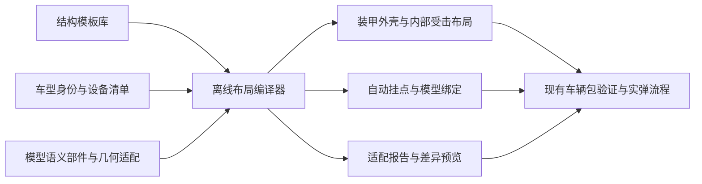

# 通用车体模块与自动适配方案 v1

2026-09-17。用户目标：新坦克复用车体受击模块，减少逐车手调契合工作，并预留后续接口。

**决定：以“结构家族模板＋车型适配描述＋离线布局编译器”生成车体内构。新车型只确认车体边界、舱段和确实存在的设备；模块坐标、挂点、引用及验收报告由工具生成。** 模型不必为每个受击模块单独制作空节点。

本次交付为设计与 v1 输入 Schema，尚未实现自动拟合器，也未迁移现有战斗车。目标是大多数常规单炮塔履带坦克及常规坦歼；覆盖率需用实际车池评估，不先承诺百分比。

## 1. 现有工程如何接入

当前可继续使用的运行时结构：

| 现有接口 | 本方案用途 |
|---|---|
| `VehicleLayoutDefinition` | 接收编译后的部件、装甲面、模块和乘员布局 |
| `ModuleVolumeDefinition` | 继续使用局部有向盒、kind、容量、隔离规则和证据键 |
| `CrewStationDefinition` | 岗位清单明确指定，位置由槽位生成，不固定为四人 |
| `LayoutPartDefinition` | 保存实际父子关系和刚性关节变换 |
| `VehicleCapabilities` | 继续根据模块种类结算能力；左右履带暂保留 `track_left/right` ID |
| `LoadingProfile`、`AmmoCompartmentProfile` | 消费明确装填、供弹和隔离设备配置 |
| `ModelBindingValidator`、`LayoutValidator` | 保留身份、挂接、几何和证据验证 |

当前重复劳动有两处：`HistoricalVehicleGeometry` 直接读取车型的米制模块坐标；`ModernModelMountAdapter.SPECS` 对两车分别写节点名和轮组数量。新方案把这些差异放入作者侧描述，由一个编译入口处理。当前几何生成器的三层车壳、炮塔环及固定炮塔/炮管假设不能直接覆盖无炮塔或特殊车体；不得将其静默当作通用生成器。

## 2. 四层结构



1. **结构模板库**：定义发动机、变速箱、油箱、弹架、乘员等在舱段中的相对位置与约束，不携带通用装甲厚度或通用乘员数。
2. **车型描述 HullRecipe**：选择模板、声明设备与岗位、指定容量和少量例外；精确车型 ID 不用模型名称模糊匹配。
3. **几何适配 HullFitProfile**：记录该车车壳、舱段和关节。基础车体只做一次；同车族的改型按实际变化重编译。
4. **离线编译产物**：确定的米制碰撞布局、挂点、模型绑定和证据清单。游戏运行时直接读取，不启动 Blender、不扫描外部 cache、不做实时拟合。

## 3. 模板按布局家族组织，装填等作为组合件

| 核心模板 ID | 结构 | 首批对照对象 |
|---|---|---|
| `rear_powerpack` | 动力与传动主要在后部，前部驾驶、中部战斗舱 | T-80B、豹 2A4（仍需各自适配） |
| `rear_engine_front_transmission` | 后置发动机、前置传动，明确传动轴通道 | M4 车族 |
| `front_powerpack` | 前置动力，驾驶与动力并列或错位 | 后续按具体车型确认 |
| `casemate` | 固定战斗室或有限射界主炮 | 常规坦歼；不能硬造炮塔环 |
| `open_fighting_compartment` | 战斗室有明确开口，内部暴露关系不同 | M36 作为首批开口对照，炮塔仍单独声明 |

组合件独立选择：人工装填、转盘式供弹、尾舱供弹、车体备用弹架、左右油箱、前/后传动、尾舱隔板/泄压、炮塔座圈接口。禁止由“现代坦克”标签自动添加稳定器、热像、自动装填或泄压板。

多炮塔、双车体、铰接车、轮式车及非常规悬挂先进入 `custom` 扩展流程。v1 Schema 不接受未实现的拓扑，不能把特殊车型强行压成一个通用盒。

## 4. 统一几何语言

### 4.1 坐标与运动部件

- 全部输出为米，Y 向上，车头 -Z，右侧 +X；不根据模型全包围盒判断车头。
- `drive` 是行驶刚体；`hull` 是悬挂车身；`running_left/right` 是左右行走机构。车体模块随 `hull`，履带受击盒随各自 running 部件。
- `turret`、`barrel` 是跨组件接口；炮手随炮塔，炮闩随后坐/俯仰所属机构。不能把炮塔高度重复加到模块局部坐标。
- 输入中的长宽高只用于尺度检查。炮管、天线、履带、裙板和外挂物不得把车壳内部空间撑大。
- 变换链固定为 `世界部件变换 × 部件局部模块变换`。缩放只在离线编译应用一次，运行时关节保持正交刚性变换。

### 4.2 车体拟合代理

每个基础车体保存一份简化、可分区的车壳代理，而非要求整车渲染网格封闭。推荐按纵向截面描述底板、顶板、左右侧板，车首、驾驶舱、座圈、动力舱等转折处加截面；特殊铸造曲面可改用具语义分区的低面数代理网格。

装饰网格不参与车壳推断。已有模型优先用语义部件提取代理；无法可靠分离时，工具给出候选，作者确认一次车壳和舱界。**外观网格无法证明内构位置：缺资料时只能生成已登记的设计估计，不能升级为历史事实。**

FitProfile 分别保存外部受击表面和内部可用空间：后者由明确的内壁/净空规则构成，不把弹道等效厚度当作几何壁厚。炮塔环、敞口和发动机隔墙均显式建模。

### 4.3 相对坐标与放置

每个舱段是所属运动部件中的局部参考域。模块模板使用 `uvw`：u 左至右、v 下至上、w 前至后，均为 0..1；车头 -Z，因此 w 增大对应向 +Z。槽位尺寸由舱段尺寸和模板比例得出，并受独立的实际尺寸上下限约束。

拟合流程：读取已确认边界 → 插值生成初始盒 → 检查所有角点、边和体积与舱域的关系 → 在限定平移/尺寸范围内求解 → 检查模块间相交及关节扫掠 → 输出。

OBB 在部件坐标内始终是刚体盒，不能直接非线性弯曲后仍称为 OBB。细长/环形部件可用多个简单体积，但 v1 的多体积逻辑模块属于后续扩展：现有“一模块一盒”先保持，否则必须实现按逻辑模块汇总命中、库存、火灾和维修，避免每个小盒重复算一套弹药。

无法装入时给出具体错误、冲突对象和截面图。不得通过无限缩小乘员、自动删除弹架、减少容量或放大车壳获得通过。未知参数和待确认候选保留。

## 5. 通用模块与接口表

| 类别 | 通用槽位/接口 | 车型需给出的差异 |
|---|---|---|
| 动力 | `powerpack.engine`、`powerpack.transmission` | 前/后位置、横/纵置、尺寸类别、驱动依赖 |
| 行走 | `running.left/right`、驱动/惰轮定位 | 履带宽度、纵向跨度、所属运动节点 |
| 燃油 | `fuel.left/right/aux` | 存在状态、区域、油箱数量及连通规则 |
| 弹药 | `ammo.ready/reserve.*` | 真实库存、供弹优先级、是否随炮塔、可用弹种 |
| 乘员 | `crew.driver/*` | 明确岗位列表及归属；不能按模板虚构乘员 |
| 隔离 | `partition.*`、`vent.*` | 实际模块、边界与朝向，和具体弹架绑定 |
| 炮塔连接 | `turret_ring`、座圈包络、可旋转净空 | 座圈位置/直径、偏置、舱篮空间 |
| 火炮连接 | `gun_pivot`、`breech_clearance` | 枢轴及俯仰/后坐扫掠；车体模板不生成炮口 |
| 光电/外部 | `optics.*`、`smoke.*`、`tow.front/rear` | 仅预留挂接接口，不推定设备存在 |

设备存在状态使用 `present / absent / unknown`。只有 present 且满足生成输入的设备进入候选模块表；unknown 进入缺口表，不能按 absent 静默忽略完整车辆的必需能力。总携弹与各架容量、膛内转移规则继续由已有库存系统核对。

同一渲染模型的基础型/改型可以引用同一 FitProfile；车型身份、装甲、设备、模块清单仍分别登记。裙板或新炮塔发生几何变化时只复验相应组件，不自动宣称共用外观准确。

## 6. 接口契约（作者侧 v1，待实现）

机器可读输入：[HullRecipe Schema](../../authoring/hull_templates/hull_recipe_v1.schema.json)。离线生成器将提供：

```text
resolve(recipe, template_catalog, fit_profile, source_manifest) -> ResolvedHullSpec
compile(resolved_spec, geometry_provider) -> HullBuildResult
validate(build_result, validation_policy) -> HullFitReport
emit_candidate(build_result, existing_vehicle_packet) -> CandidateBundle
```

这四个名称是待实现接口，不是已经可调用的生产函数。各阶段不修改输入，不写当前已准入车辆包。失败统一返回 `ok=false, errors[{code,path,objects,measured,limit}], warnings, missing_fields`，禁止用空产物冒充完成。

ResolvedHullSpec 必须包含来源模型/模板/FitProfile 的 SHA-256、生成器版本、精确车型 ID、部件图、已选设备及全部覆写的来源。HullBuildResult 包含 `armor_patches, modules, crew, generated_attachments, binding, dependency_graph, provenance`。HullFitReport 区分 `schema / geometry / articulation / combat / visual` 各门，不用一个 PASS 代替全部。

`CandidateBundle` 输出到独立候选目录：

```text
<vehicle_id>/<build_hash>/
  hull.generated.json       # 米制局部坐标、类型、稳定 ID
  fit_report.json           # 冲突、净空、命中覆盖、未完成门
  provenance.json           # 模板/模型/配置/编译器来源身份
  binding.generated.json    # 与现有 ModelBinding v1 对接
  vehicle.bound.glb         # 需要补挂点时的派生件，原件不覆盖
  preview/                 # 六向剖切与部件运动截图
```

稳定 ID 不依赖数组顺序，生成路径使用车型＋模板槽位。配方按组件白名单覆写，未知键拒绝；显式 add/remove/replace，不用任意深合并悄悄继承旧弹架。

输入资源还需以下配套契约，随编译器 A 批实现；本轮没有把它们冒称为已存在的资源加载器：

| 资源 | v1 必需字段与语义 |
|---|---|
| `HullTemplate` | `schema_version, id, version, topology, region_requirements, slots, interface_requirements`；每个 slot 指向明确的部件、舱域和组件，不能内置某辆车的米制中心点 |
| `HullFitProfile` | `schema_version, id, compatible_vehicle_ids, source_model_sha256, frame_convention, semantic_nodes, exterior_proxy, interior_domains, regions, landmarks, evidence_refs`；代理及内域资源带路径和哈希 |
| `regions[]` | `id, part, origin_m, rotation_deg, size_m, interior_domain_id`；size 必须为正，舱域 OBB 只是放置参考，最终包含性以 interior domain 为准 |
| `landmarks[]` | `id, part, position_m, direction, clearance_m, evidence_refs`；语义名注册表定义座圈、隔墙、传动端等含义，缺必要定位点明确拒绝 |
| `HullComponent` | `schema_version, id, version, kind, slots, geometry_constraints, behavior_profile_ref, evidence_refs`；装填/弹架策略明确引用现有规则，不能只凭名字接设备 |
| `HullValidationPolicy` | 版本、哈希、包含性/净空/扫掠公差、允许重叠具体对象对、最大拟合位移/尺寸变化；作为独立输入锁定，失败后不得扩大公差自动再试到通过 |

所有 `rotation_deg` 使用绕局部轴的 Godot **YXZ** 欧拉约定（数组仍按 x/y/z 分量排列），导入非均匀缩放先烘焙。`center_uvw` 定位遵循 `region_origin + region_basis × ((uvw - 0.5) × region_size)`；OBB 尺寸先由 `size_fraction × region_size` 得出，再在模板已登记上下限内求解。舱域 reference origin 是盒中心。采用截面非线性映射时须另增带版本的 placement 模式，不能悄悄改变本式。

组件/车型的每项值保留 `origin, status, source_refs, location`；几何估计、历史事实与游戏设计规则沿用现有证据门。Schema 只验证字段形状；跨资源引用、身份、实际文件哈希、岗位唯一性、尺寸上下限及碰撞验证必须由 resolver/validator 实现。

### 6.1 兼容现有模型绑定

老模型只需一次性登记 hull/turret/gun/running 等语义节点映射。生成器计算完模块布局后，自动在正确父部件下生成 `Attachment_<stable_id>`，产出派生 GLB，再交给现有绑定校验。保存原始与派生两个文件哈希，原模型只读。

挂点与模块位置来自同一产物，二者一致只能证明装配正确，不能证明贴合真实车壳。几何拟合门必须独立对照源模型分离出的代理和已确认舱域，不能自证。

### 6.2 兼容现有游戏逻辑

第一阶段输出当前 packet 的 `modules / crew / model_binding` 和独立证据字段，沿用现有运行时资源；不改弹道/网络协议。装甲外皮先沿用已审核的原面，通用编译器优先解决内部模块和挂点。

车体装甲代理编译在第二阶段接入：面片 zone 只负责空间归属，厚度、材料、复合响应、ERA 和开口必须来自单独防护配置。不从视觉厚薄、舱域尺寸或整体缩放推断弹道数值。

现有车辆无 recipe 时走旧入口；有 recipe 时必须完整生成并验证，失败不能静默回退到旧盒子。新增模块类型先完成生产毁伤能力映射，再允许模板使用。新增拓扑需要另一个布局构建入口，不能绕过当前生成器的三环约束。缓存、回放和未来网络共同引用已编译布局版本/哈希，不在客户端自行重新拟合。

## 7. 以后接入一辆车的操作

1. 选精确车型与原模型，选择结构家族；填写设备、岗位和库存。数据解析可以预填，冲突/未知仍显示。
2. 工具提取 hull 等语义部件，测量车壳代理、底板/顶板、前后舱界与座圈。已有车族直接复用，通过模型哈希和差异报告确认。
3. 一键生成模块、局部坐标、挂点和候选包。作者只处理被标出的失败项，修改舱界或少数槽位，不逐车重写模块数组。
4. 查看剖切和转炮/俯仰/悬挂扫掠；通过后执行固定实弹、战损与库存/恢复场景。
5. 准入成功后导入游戏包。模板更新只生成差异候选，不自动批量覆盖已交付车辆。

理想新增成本从“摆几十个受击盒＋补所有挂点”下降为“确认一份结构清单＋少量车体控制点＋处理例外”。一次性车型适配和结果检查仍保留。

## 8. 实施顺序与验收

| 批次 | 实现内容 | 通过标准 |
|---|---|---|
| A | Schema、模板解析、稳定 ID、明确错误、原包兼容适配 | 错单位/错车型/缺设备/缺部件/错误引用拒绝；输入不可变 |
| B | 舱域尺寸/定位、受限盒放置、自动挂点、差异预览 | T-80B 与豹 2A4 可从配方生成；现有核对过的模块/库存/装填保持语义一致 |
| C | 前传动与敞口/炮塔组合，导出及恢复 | M4 与 M36 验证复用范围；生成后的包内绑定和实弹流程通过 |
| D | 从语义代理生成车壳装甲面，多拓扑扩展 | 内外法线、开口、层间距、面片分区及弹道结果核对 |
| E | 批量导入工具与车族差异管理 | 同车族第二辆主要靠配置完成；实际记录人工覆写数量及原因 |

每辆验证：源几何独立包含性/允许重叠；转炮、俯仰、后坐、悬挂极限姿态；前后左右上方实际弹丸路径；发动机/左右履带/供弹/乘员损失；总弹量守恒；维修和新生命；模型重导入不漂移。允许重叠必须限定具体对象对和原因，不能全局忽略。

评估复用收益使用实际指标：新车型需要修改的控制点数、模块例外数、人工时间、自动适配拒绝原因。与原手动流程比较后再确定支持车池范围。

**本方案先复用制作流程与空间结构，不将不同坦克做成同一内构。** 当前历史四车和现代两车原配置继续工作，待按上述批次迁移后，才能声称新车已免除逐模块手调。
