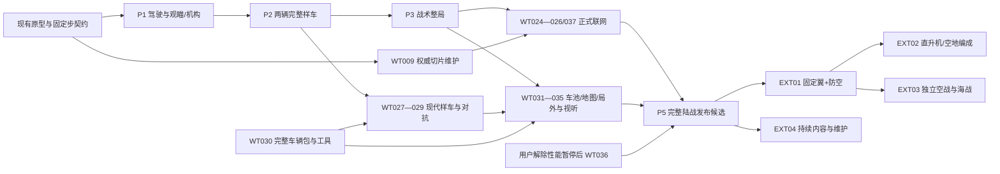

# MCTHUNDER 全部剩余工作执行计划

2026-09-12；规划源码基线 `5f24ae6`，计划提交 `c193693`。用户已要求并行实施全部计划，第一批正在实现。游戏总目标保持完整陆战、现代对抗、空地、独立空海和持续维护。

最新执行决定：现代陆战优先，首先苏联、德国，现代样车 T-80B / 豹 2A4；M4A3 / M24 保留基础回归。数据读取 `E:/AIprogram/tank_data/cache`，模型从 `E:/AIprogram/aimodel` 接收完成交付；外部源只读，工程内候选与正式战斗包分开准入。主集成者与弹道、网络、数据内容三个槽位并行；共享命令、Actor和协议版本由主集成者统一。完整42项范围保持，性能HOLD保持。

## 1. 本计划依据与当前状态

最新附件 `01_当前进度与完整路线.md` 与仓库 [完整路线](ROADMAP_CONTINUATION_2026-09-11.md) 的 SHA-256 完全一致：`96801FBDF55279DB50461F87D03F8B03C2D2C274D68CE4931B5CF5F884EEDB24`。因此保留原文为产品路线，本文件补上截至当前源码的剩余执行清单，不另建冲突编号。全部原始要求仍在 [GAP_REGISTER.json](GAP_REGISTER.json)，本计划的结构化版本为 [EXECUTION_PLAN.json](EXECUTION_PLAN.json)。

本轮读取当前生产代码、资产注册和已有测试记录；这是状态审计与规划，没有重跑全游戏或新增真人验收。以下“已有”只表示对应功能/证据存在，不代表新范围整体通过。

| 当前领域 | 已有进展 | 仍需完成 |
|---|---|---|
| 工程 | 统一工作区、main主线与正常启动入口 | 最新完整源码到独立客户端/专服包的最终对应 |
| 车辆 | 动力/差速/战损机动、独立左右机构、四点有界悬挂 | 侧滑/接触边界标定、正常输入整车手感与救援规则 |
| 观瞄 | 车型镜位/倍率、望远镜、观察保持、意图/炮口圈 | AimIntent、测距、真实装定、刻度、机构及稳定能力 |
| 战斗 | 有限弹速、AP/APHE、面片装甲、内部损伤、真实弹药、恢复 | 有限截面/运动接触、弹族/材料、穿后/引信和能力深化 |
| 对局 | 离线4v4单点、票池、阵亡再出击、AI、车库和结算 | 战术地图/情报/烟幕/支援、团队AI、多点/出击资源及完整体验 |
| 联网 | 本机独立服务器和两客户端、权威输入/射击、姿态插值 | 正式4v4、预测纠正、可信会话/结算、房间/连续局；再验8v8 |
| 内容 | 四款历史战斗包、两图；多个现代美术候选 | 完整现代能力样车、合理双方车池、约8—12完整车和3图 |
| 产品 | 中文车库/HUD/教程/设置、声音、双槽档案等已有 | 扩展系统的一致交互、可信在线进度、高DPI、完整新手流程及发布 |
| 空海 | 目标及工单保留 | 独立系统、样车/机/舰、地图、模式与各自验收 |

附件的“先做WT-006B/C”基于旧9f59025，当前不重做这两个增量；WT-006D整体验收仍未完成。已有履带支撑对牵引的约束不再列为从零待做。旧007—036是内部离线原型历史，不等于新WT-001—038完成。

本轮刚开始的测距数学/传输改动已保存到 [未验证草稿](drafts/WT007_RANGE/README.md)，未接入运行源码、未验收。仅恢复了本轮自己的半成品；原有6个模型相关修改保留。游戏主线仍为5f24ae6，命令v2/网络v3。

## 2. 全部工作的先后顺序

| 顺序 | 阶段及工单 | 本阶段交付结果 | 退出条件 |
|---|---|---|---|
| 0 | WT-001/002/003A，贯穿全程 | 版本身份、正确时序、交战尺度与恢复契约 | 后续功能有同一权威入口和可追溯状态 |
| 1 | P1：WT-007剩余→008→006D，收口004/005 | 两车能越障、急停、测距/瞄准、开火、倒车撤回 | 驾驶与开火时机差异可理解，工程和正常输入路线均过 |
| 2 | P2：WT-010→011→012→013→014→015，006E/015B救援基础→016 | 两辆完整战斗样车 | 正常弹丸造成可解释后果，战损/恢复有决策价值；真人单列 |
| 3 | P3：WT-017→018/019→020→021；022→023 | 一张完善地图与完整战术对局 | 从正常车库到一局、结算、下一局；有不同路线/反制/团队作用 |
| 支线A | WT-009随核心更新；024→025/026→037 | 早切片升级为完整权威团队战及连续房间 | 先真实4v4，再验证8v8；有身份、恢复、信息权限和异常网络证据 |
| 支线B | WT-030可先整理工具；027→028→029 | 现代能力样车与对抗质量门 | 通用火控/毁伤/情报接口成熟即可开，不等旧车量产 |
| 4 | P4：WT-031/032，衔接033/034/035 | 合理双方车池、3图及完整局外交互 | 每辆车、每张图均通过自己的完整交付矩阵 |
| 5 | P5：WT-033—038，包含正式网络收口 | 可独立运行的完整陆战客户端与专服 | 玩法、内容、体验、网络、稳定性各门通过；性能恢复后达标 |
| 6 | P6：EXT-01→02；EXT-03空战/海战各线 | 更完整载具战争版本 | 各自完成样片、独立对局、联网/教学/结算后再扩量 |
| 持续 | EXT-04及版本/质量维护 | 工具产能、兼容、平衡、复现、更新回退 | 每个新增内容和版本有可追溯证据，不宣称永远无需维护 |

`WT-003A` 是本计划对交战距离工作的切分，`WT-003B` 是暂停的性能部分；仍归WT-003，未增加新的顶层编号。WT-006A/B/C/D同理。WT-008可以依赖已经实现的006C机械姿态入口，006D综合体验在008后进行；这避免“先完整006才能做008、先做008才能验006D”的循环。

救援再明确拆为：**WT-006E受控推挤/翻覆/拖救基础、WT-015B协助恢复接口在P2、WT-016之前完成**，验证真实车辆约束、受损条件、连接/取消/中断和恢复；不依赖尚未完成的WT-018支援奖励。WT-018随后接正式支援操作、侦察及奖励，WT-024同步多人规则。P1出口不将WT-006整体签完；006E与015B尚缺时也不签WT-016完整门。救援采用明确受限的玩法规则，不展开逐链节刚体模拟。这保留了原始依赖而不把必需项推到样车门之后。

图中的现代支线不强迫所有旧车内容等待现代量产；若先交窄年代内部候选，必须明确它只是中间版本。用户的现代目标以及后续空海目标始终保留。

## 3. 下一段具体怎么执行

| 子任务 | 实施内容 | 完成证据 |
|---|---|---|
| WT-007A（已交增量，保留） | 镜位、倍率、望远镜、观察保持及误射/敌车隐藏修复 | 5f24ae6、WT007_OPTICS、235项专项与26项真实窗口记录；不重新搭建 |
| WT-007B | 核对现有AimSolver/弹道规则；冻结AimIntent、装定状态、来源/单位/有效域与服务器处理 | 数据仅表示意图；本地/AI/网络命令、快照、暂停/换车不串状态 |
| WT-007C | 手动距离装定与真实低伸射击解；按已装入膛内弹的初速/重力处理 | 同距离/高差/不同弹种实际发弹；错误装定会偏离，正确装定改善落点；机械限位仍生效 |
| WT-007D | 测距过程、持续时间/量程/精度/无回波反馈；普通与未来现代设备按能力配置 | 世界和车辆遮挡一致；不穿墙测距；新测量不会自动变成未授权的稳定/提前量；联机只给应知信息 |
| WT-007E | 炮镜刻度、倍率与角度投影、装定/测距的中文可改键交互；窄墙/棚顶镜位边界 | 分辨率/倍率下刻度正确；正常按键能完成测距→装定→射击；退出观察、换弹、重生无旧边沿 |
| WT-008A/B | 机构加减速、动态俯仰限制，随后按车接无/单向/双向稳定及受损降级 | 固定输入路线的实际炮口方向/误差/首发记录；视觉舒适设置不改变武器性能 |
| WT-006D + WT-004/005 | 两车全路线、坡道/材质/转向/战损机动标定 | 正常入口“越障→急停→建立瞄准→射击→倒车回掩体”，再受损恢复重返战斗 |
| WT-010—015 | 连续运动与有限截面→弹族材料→穿后引信→能力与恢复深化 | 每项新增反例、真实弹丸结果及原有四车回归；不另造平行伤害系统 |
| WT-006E/015B | 受控推挤/翻覆/拖救、协助恢复基础；正式支援奖励留给018 | 实际受损车辆的连接、移动约束、取消、再受损/断开及恢复；在016前完成，不靠临时改坐标 |
| WT-016 | 两车完整包、完整操作、八类战斗结果及真人问题修订 | 三段完整录屏、逐车真实炮弹结果矩阵和玩家原话；阻断问题关闭；无人参与则如实保留真人待验 |

这是一组可连续执行的工作，不将“加一个按钮”“增加几条断言”当作阶段完成。每次提交仍保持可运行；单个补丁按独立契约和功能拆分，避免半成品协议进入主线。

## 4. 并行、暂停与决策安排

- 主程序线优先车辆/火控→毁伤→战术对局。网络支线维护相同契约，UI/音效随功能同步；同一执行器或契约由一人集成，避免相互覆盖。
- 现代样车在008/012/013/015/017所需接口可用后早开。完整包工具和来源核验可并行，批量车池必须等样车质量门。
- **性能优化保持HOLD**：不启动热点重构、缓存专项、全图压缩或大规模容量扩张。崩溃、无限增长、明确状态错误属于持续正确性维护。解除暂停后再执行WT-003B/036及8v8容量证明；16v16独立验收。
- 当前基础样车M4A3/M24；核心地图先精修丘陵村落，工业边缘作差异地图及回归。现代优先苏德T-80B/豹2A4，具体装备和升级配置按来源/完整车能力门核对；M1A1族后续保留。
- 已冻结现代陆战及苏德优先；其余逐车名单、规则预设、三图尺度、目标硬件、成长成本和房间环境沿各工作包在依赖具备时落实，不编造日历工期。
- 规划采用两阵营约8—12车、3图和8v8首版目标；这些是待验证的内容/容量目标。首发不能为凑数混入不具备完整装备或年代悬殊的车。
- 公开部署、商店提交、收费/购买服务在成果可审阅后按实际需求另行取得授权；不妨碍本地代码、离线包和本机网络验证。
- 已进入WT-007/010/009/030第一批并行实施，完成实际验证后连续推进依赖包。单批通过不代表完整游戏目标完成。

## 5. 所有工作统一的完成标准

每个工作包保留五列：逻辑正确、正常玩家流程、真人体验、网络一致性、发布稳定性。某列对该增量不适用要说明原因；尚未运行不得写PASS。源码中有功能、一次自动测试通过、模型看起来正确，都不能自动证明其他列通过。

实际交付至少附：新增玩家能力、生产入口、源码/内容/规则/协议版本、真正执行的命令及退出码、必要反例和正常输入证据、已知问题、未验收项及下一动作。旧失败日志不改写，历史测试数量不累加成成品百分比。引擎保持Godot 4.7.2普通版/GDScript/Compatibility，不借规划更换技术栈。

两个完成样车必须能走完观察/机动/测距/瞄准/攻击部位/受损撤离/恢复；一局必须能走完编成配弹→出击→交战支援→阵亡再出击→结算成长→下一局。现代、空战和海战各有对应能力/地图/模式/网络/教学/结算门，不由陆战门代签。

优先修阻断问题：崩溃/档案丢失、输入串生命、真实射击与显示不一致、无法完成正常流程、权限或结算错误。手感/地图/信息可读性问题要记录具体条件和修订结果。性能分位数目标只在硬件/版本/人数冻结后评判，不以空场平均FPS代替整局。

## 6. 全量42个工作包

以下逐单给出现状、剩余实现、依赖、交付物与退出条件。原始要求全文以GAP_REGISTER对应ID为准，未删除或缩减；本表将执行安排补齐。WT-003和WT-036中的暂停仅影响性能专项，不取消最终交付要求。

### WT-001 · 贯穿全程

**已有状态：** 统一工程和主线已合并；当前源码为5f24ae6，旧发行包不对应最新能力。

**依赖：** 无。原始依赖表示相关能力可用；分段实施与综合质量门按第2节处理。

**剩余工作：** 补当前候选源码/内容/规则/引擎/构建身份；核对文档与入口；接到最终独立包。

**交付物：** BASELINE与构建清单、状态入口、源码→测试→包的追溯表。

**验收条件：** 正常启动、被测源码、独立包逐一对应；用户原有模型修改有明确归属。

### WT-002 · P1/NET

**已有状态：** 固定步炮塔、命令v2、生命身份、调度与快照已有；恢复与输入确认未完整。

**依赖：** WT-001。原始依赖表示相关能力可用；分段实施与综合质量门按第2节处理。

**剩余工作：** 补已消费输入确认、事件缺口/恢复、完整可恢复状态；随火控及毁伤版本升级契约。

**交付物：** 命令/发射/比赛事件/快照版本与恢复规范，固定步时序和迁移测试。

**验收条件：** 30/60/144帧及长帧输入结果一致；暂停/换车无旧输入；恢复后的状态与持续运行对照一致。

### WT-003 · P1；性能HOLD

**已有状态：** 历史车瞄准/视距已与2500m弹丸预算关联；AI180m、声音240m等尚未形成完整交战配置。

**依赖：** WT-001。原始依赖表示相关能力可用；分段实施与综合质量门按第2节处理。

**剩余工作：** 先做交战尺度配置与远目标可读性；性能采样、热点优化及8/16/32车容量在解除暂缓后实施。

**交付物：** EngagementProfile、硬编码/地图/光学/AI/声音距离审计；恢复性能时交付完整基准数据。

**验收条件：** 无观察/瞄准/炮弹生命周期断层；完整局指标绑定机器及场景；未跑容量档保持未验。

### WT-004 · P1

**已有状态：** 两车独立动力、换挡迟滞、坡阻、路面阻力与制动已有。

**依赖：** WT-002。原始依赖表示相关能力可用；分段实施与综合质量门按第2节处理。

**剩余工作：** 补平地/坡道/材质的统一标定，检查加速、刹停、倒车回掩体的正常操作差异。

**交付物：** 两车DriveProfile标定表、输入路线和设计值/史料分类。

**验收条件：** 相同路线不看速度数字也能区分两车；坡阻连续、制动和倒车可控；真人结论独立记录。

### WT-005 · P1

**已有状态：** 差速状态、转向损速、单/双断带限制与维修恢复已有。

**依赖：** WT-004。原始依赖表示相关能力可用；分段实施与综合质量门按第2节处理。

**剩余工作：** 补高速/倒车转向、转弯半径、侧滑与接地牵引约束的标定；检查动画与真实运动一致。

**交付物：** 车型转向能力矩阵、单侧失能/维修完整路线。

**验收条件：** 双侧失能禁行，单侧行为符合配置；高速转向不无代价旋转；轮履动画不由按键伪造。

### WT-006 · P1/P2救援基础

**已有状态：** 006A结构、006B左右机构/受击体积、006C四点有界悬挂已有工程证据；整体体验未验。

**依赖：** WT-004、WT-005。原始依赖表示相关能力可用；分段实施与综合质量门按第2节处理。

**剩余工作：** 完成006D越障/急停/射击/倒车/战损恢复；补窄巷、残骸和碰车边界。006E受控推挤/翻覆/拖救基础在P2、016前完成；018再接正式支援奖励，不无限扩大履带研究。

**交付物：** VehicleDynamics/Presentation边界记录、综合测试路线；推挤/翻覆/拖救规则与真实约束。

**验收条件：** 无长期明显悬空/反复穿地弹跳；炮口/装甲/内构同姿态；救援可控且不绕过战损/比赛规则。

### WT-007 · P1 当前下一项

**已有状态：** OpticsProfile、两档炮镜、望远镜、观察保持、意图/炮口圈与偏差已接入。

**依赖：** WT-002、WT-003。原始依赖表示相关能力可用；分段实施与综合质量门按第2节处理。

**剩余工作：** 补AimIntent、炮镜刻度、测距及真实距离装定；处理镜位侵入窄墙/棚顶，按模式限制辅助情报。

**交付物：** 版本化光学意图/测距装定状态，输入/UI/联机契约，真实弹道验证。

**验收条件：** 装定改变实际炮管射击解；射击仍从真实炮口出发；无回波/限位/换弹/暂停/重生/联机边界均可解释。

### WT-008 · P1

**已有状态：** 有限机械速度和静态俯仰限制已有；完整稳定器、机构加减速未完成。

**依赖：** WT-006、WT-007。原始依赖表示相关能力可用；分段实施与综合质量门按第2节处理。

**剩余工作：** 加入加减速、追随滞后、动态俯仰限制、无/单向/双向稳定能力及损伤降级；纠正按车型的横滚呈现。

**交付物：** FireControlProfile、固定步执行器、意图/视线/炮管/稳定状态记录。

**验收条件：** 同一路线移动和急停射击有能力差异；稳定准星不冒充炮管已到位；舒适设置不增加武器能力。

### WT-009 · NET早验证

**已有状态：** 独立本机服务器+双客户端、权威移动/射击和姿态插值已验证；仍是固定两车切片。

**依赖：** WT-002。原始依赖表示相关能力可用；分段实施与综合质量门按第2节处理。

**剩余工作：** 补客户端弹丸/炮声/命中呈现、完整下行校验、消费确认、事件缺口补发及恢复；随核心状态更新同步。

**交付物：** 三进程回归、每发弹丸身份链、恢复快照与事件确认。

**验收条件：** 超过缓存长度及短断包不漏/重复结果；服务器无本地玩家也能运行；不能由客户端宣告命中。

### WT-010 · P2

**已有状态：** 有限弹速、恒重力分段积分和部分移动目标回归已有。

**依赖：** WT-002、WT-003。原始依赖表示相关能力可用；分段实施与综合质量门按第2节处理。

**剩余工作：** 标定短/中/远距离、弹速/重力/衰减、相对运动、炮塔运动和生命周期；统一视觉/物理/服务器时间轴。

**交付物：** BallisticProfile和版本、射程/移动目标测试集、单步续飞/终止记录。

**验收条件：** 高速弹丸及横移/旋转目标连续接触可靠；同一发弹的显示/命中/记录相符；未知数据明确标识。

### WT-011 · P2

**已有状态：** 现有装甲面片与线段查询可复用，尚不是完成的有限截面弹丸。

**依赖：** WT-010。原始依赖表示相关能力可用；分段实施与综合质量门按第2节处理。

**剩余工作：** 加入有限截面的连续接触、入出射、炮盾叠层、接缝/边缘/履带外挂与旋转几何；去重同一连续层。

**交付物：** ShapeContact/ArmorLayer契约、标准板/双层/窄缝/边缘/旋转炮塔夹具。

**验收条件：** 不能钻过小于弹体的非合理缝隙；不重复扣同一层；视觉LOD切换不改变战斗几何。

### WT-012 · P2

**已有状态：** 已有穿深曲线、厚度/cos、跳弹/续飞预算；弹族材料规则仍简化。

**依赖：** WT-010、WT-011。原始依赖表示相关能力可用；分段实施与综合质量门按第2节处理。

**剩余工作：** 分离弹族与材料响应、角度/尺寸关系、剩余能量或预算单位；完善AP/APHE/HE的用途。

**交付物：** ArmorResponseProfile/ShellResponseProfile、旧规则兼容、距离×角度×材料×弹族矩阵。

**验收条件：** 未穿/跳弹/停止/续飞边界稳定；弹种选择有实际差异；不把设计公式当未公开史实。

### WT-013 · P2

**已有状态：** 已有APHE路径与有界破片基础。

**依赖：** WT-012。原始依赖表示相关能力可用；分段实施与综合质量门按第2节处理。

**剩余工作：** 深化残余弹体、背面破片、内部遮挡、引信条件/延迟、出车后起爆和HE外部效果。

**交付物：** PostPenetrationProfile、独立随机流、同源破片/爆炸事件与遮挡夹具。

**验收条件：** 空腔/遮挡/人员区结果不同；不是全车球形扣血；同版本可复现，视觉随机不影响毁伤。

### WT-014 · P2

**已有状态：** 无整车总HP、模块/乘员和能力限制已有。

**依赖：** WT-013。原始依赖表示相关能力可用；分段实施与综合质量门按第2节处理。

**剩余工作：** 区分动力/传动/炮闩/炮管/炮塔驱动/岗位与光电失能；统一能力依赖、原因和受损几何对应。

**交付物：** CapabilityState、岗位/替补约束、部件轮廓与能力矩阵。

**验收条件：** 不同部位产生不同操作后果；空岗位/已毁部件无无限假吸收；HUD/AI/声音/回放读同一事实。

### WT-015 · P2

**已有状态：** 真实弹药账本、膛内/搬运、火灾、维修、替补、补给已有。

**依赖：** WT-014。原始依赖表示相关能力可用；分段实施与综合质量门按第2节处理。

**剩余工作：** 深化待发弹架、搬运/装填手影响、维修选择风险、再损坏取消；人工/自动装填分车型。015B协助维修/拖救接口与006E在016前完成，018随后接支援奖励。

**交付物：** 版本化Inventory/Reload/Recovery状态机、库存与空间占用核对、恢复条件/取消原因。

**验收条件：** 少带弹改变弹架风险；换弹不偷换膛内弹；炮闩/装填手/待发耗尽后果不同；死因与残骸一致。

### WT-016 · P2质量门

**已有状态：** 两样车有多项增量工程证据，尚无完整体验签收。

**依赖：** WT-004、WT-005、WT-006、WT-007、WT-008、WT-010、WT-011、WT-012、WT-013、WT-014、WT-015。原始依赖表示相关能力可用；分段实施与综合质量门按第2节处理。

**剩余工作：** 用M4A3/M24作为当前质量样车，完成正常输入综合体验、问题分级及修订。

**交付物：** 坡顶急停射击/绕侧攻击/断带恢复完整录屏；M4A3/M24逐车真实炮弹结果矩阵，覆盖未穿、跳弹、穿透未毁、武器失能、机动失能、弹药相关死亡、乘员损失、恢复；新手与熟悉此类游戏玩家反馈。

**验收条件：** 八类场景各记录真实发弹身份、命中部位/规则、能力后果及可用下一操作，不用驾驶视频或脚本扣血代替；玩家能解释射击/战损；车辆差异可感知；阻断问题关闭；无人试玩则保持真人待验。

### WT-017 · P3

**已有状态：** AI视线与6秒最后位置、HUD情报已有；声音/烟幕/传感器统一规则尚缺。

**依赖：** WT-007、WT-014。原始依赖表示相关能力可用；分段实施与综合质量门按第2节处理。

**剩余工作：** 建立ObservationState/VisibilityPolicy；统一观察点、可见比例、声音、开火暴露、侦察与记忆；限定命中小窗/死亡镜头/观战信息。

**交付物：** 情报权限矩阵、烟幕与可见光/热像规则、失去目标原因。

**验收条件：** AI不透墙读实时隐蔽状态；降低画质不删玩法遮蔽；最后位置不偷偷实时更新。

### WT-018 · P3

**已有状态：** 主炮与恢复接口可复用；机枪/玩法烟幕/完整支援未按新范围完成。

**依赖：** WT-015、WT-017。原始依赖表示相关能力可用；分段实施与综合质量门按第2节处理。

**剩余工作：** 按车加入同轴/车顶武器、独立弹药射界、烟幕、侦察标记、地图标点、协助维修和救援奖励。

**交付物：** WeaponMount、SmokeVolume、支援事件与收益归属；与WT006受控拖救对接。

**验收条件：** 辅助武器真实结算；烟幕同时作用玩家/AI/网络；辅助操作不能越过核心命令权限。

### WT-019 · P3

**已有状态：** 丘陵村落与工业边缘已可用；完整战术质量门未过。

**依赖：** WT-003、WT-006、WT-017。原始依赖表示相关能力可用；分段实施与综合质量门按第2节处理。

**剩余工作：** 先完善丘陵村落：近/中/远射界、侧翼、坡顶、反制、多个出生出口和目标点；同步破坏/残骸的视觉、物理、观察、导航。

**交付物：** 地图流线/射界/出生安全图、EngagementProfile、接敌/路线/击毁位置记录。

**验收条件：** 各角色有作用且能反制；无一处安全位封锁全部出生出口；不以长时间空跑假装战术规模。

### WT-020 · P3

**已有状态：** 已有感知、反应延迟、瞄准误差、搜索、维修和无弹后撤。

**依赖：** WT-008、WT-017、WT-018、WT-019。原始依赖表示相关能力可用；分段实施与综合质量门按第2节处理。

**剩余工作：** 补掩体/射界/暴露评分、装填后退、侧翼/换位、放弃无效互射；决策只用合法观测。

**交付物：** TacticalPosition、行动评分与理由码、正常战斗录像。

**验收条件：** AI表现出可理解战术并可反制；难度不偷偷改装甲、弹药或视野；旧维修修复保持。

### WT-021 · P3

**已有状态：** 已有路径重试、交通与脱困基础及遥测。

**依赖：** WT-020。原始依赖表示相关能力可用；分段实施与综合质量门按第2节处理。

**剩余工作：** 加入占点/防守/侧翼/支援分工、车宽和窄口协调、路口让行、倒车脱困、残骸重规划。

**交付物：** TeamObjectiveAllocator、交通分类与处理记录、两图多出生/种子完整局。

**验收条件：** 队员不全部挤同一入口；真堵塞有原因与恢复；驻守/维修/装填等待不被强迫乱跑。

### WT-022 · P3/NET

**已有状态：** 离线4v4票池、单占点、重生、出生保护和结算已有。

**依赖：** WT-015、WT-019。原始依赖表示相关能力可用；分段实施与综合质量门按第2节处理。

**剩余工作：** 版本化主占点规则与辅助预设；补多点、出击资源、编成消耗、助攻/侦察/补给收益、弃车/友伤/观战/断线/残骸救援规则。

**交付物：** MatchRules/LineupState/SpawnBudget、比赛事件表、结算收据。

**验收条件：** 再出击同时受时间/编成/资源约束；目标/支援/击杀均有价值；重复/晚到事件不刷票和收益。

### WT-023 · P3质量门

**已有状态：** 旧离线对局和挑战闭环已有，新增战术与合作完整体验未验。

**依赖：** WT-016、WT-018、WT-021、WT-022。原始依赖表示相关能力可用；分段实施与综合质量门按第2节处理。

**剩余工作：** 从正常车库完成完整一局及下一局，覆盖受损/恢复/阵亡/换车/结算；合作体验随正式联网一起验。

**交付物：** 当前独立构建、两局连续记录、模式/难度说明、首次启动体验报告。

**验收条件：** 不用调试菜单造击毁/清冷却；流程能结束与愿意再玩分别记录；问题落到具体修复。

### WT-024 · NET正式

**已有状态：** 当前仅本机两客户端训练切片；正式多人比赛未完成。

**依赖：** WT-009、WT-022。原始依赖表示相关能力可用；分段实施与综合质量门按第2节处理。

**剩余工作：** 复用离线规则实现真实4v4；同步完整车辆/毁伤/恢复/出生/票池/胜负、烟幕/破坏/残骸与晚加入；后验8v8。

**交付物：** 服务器/客户端构建、可靠生命/结果通道、有序快照、全局状态恢复。

**验收条件：** 8个真实客户端整局权威一致；换生命旧包无效；晚加入/观战看到正确世界且不泄露内部敌情。

### WT-025 · NET正式

**已有状态：** 已有远端姿态插值，本车尚无完整预测/纠正。

**依赖：** WT-024、WT-010。原始依赖表示相关能力可用；分段实施与综合质量门按第2节处理。

**剩余工作：** 建立统一网络时钟、输入确认、本地预测/纠正、有限历史和有限弹速延迟政策。

**交付物：** RTT/抖动/丢包复现器、纠正/事件延迟/争议命中日志。

**验收条件：** 主矩阵RTT 0/80/150ms、丢包0/1/3%逐档记录；假旧时间戳无优势；视觉不裁定命中。

### WT-026 · NET正式

**已有状态：** 已有控制者分配、部分输入数值/序号/tick/限流校验；完整会话与可信在线档案未做。

**依赖：** WT-024。原始依赖表示相关能力可用；分段实施与综合质量门按第2节处理。

**剩余工作：** 补账号/会话、原席位重连、RPC/管理权限、输入频率与出生成本校验、服务端幂等收据、离线/在线信任域、备份/删除规则。

**交付物：** 权限矩阵、身份恢复、在线结果收据与恶意/重复输入反例。

**验收条件：** 改本地存档不增加在线资源；未经认证不能改他人或比赛状态；断线/重放不重复结算。

### WT-027 · P4 可早开

**已有状态：** M1A1已有美术候选/外观试驾改动，现代作战包未完成。

**依赖：** WT-008、WT-012、WT-013、WT-015、WT-017。原始依赖表示相关能力可用；分段实施与综合质量门按第2节处理。

**剩余工作：** 按最新授权先做T-80B/豹2A4现代样车，按缓存来源和模型交付冻结装备配置；接稳定/测距/热像/弹族/防护/乘员弹架与火控损伤。M1A1族作为后续扩充保留。

**交付物：** 完整VehiclePackage、能力/来源/估计/设计分栏、中远距与受损光电测试。

**验收条件：** 现代外壳不套旧车全部参数；人工装填不误配自动机；未知防护不冒充精确历史值。

### WT-028 · P4

**已有状态：** 现代装备尚未形成统一生产能力。

**依赖：** WT-027。原始依赖表示相关能力可用；分段实施与综合质量门按第2节处理。

**剩余工作：** 按具体车型接APFSDS/HEAT、复合/间隙/ERA、防护消耗、自动装填、供电/火控、夜视/热像/告警；雷达/APS按实际车型需要排入。

**交付物：** ModernCapabilityGraph、ERA重击/设备失效/不同装填机制测试。

**验收条件：** 失能设备不提供完整辅助；烟幕按波段和装备生效；不为所有现代车开启全套能力。

### WT-029 · P4质量门

**已有状态：** 99A/豹2等有资产候选，尚未证明现代对抗。

**依赖：** WT-027、WT-028、WT-019、WT-022。原始依赖表示相关能力可用；分段实施与综合质量门按第2节处理。

**剩余工作：** 验证苏德T-80B/豹2A4现代距离、节奏、反制及角色覆盖，再扩充双方完整车池。

**交付物：** 现代对抗完整局、车池能力矩阵、设计近似及平衡说明。

**验收条件：** 现代首发必须过此门；不能用两辆都叫主战坦克证明平衡，也不把旧车首版当现代完成。

### WT-030 · P1起并行，P4收口

**已有状态：** 可编辑源、导出/挂点、四层几何和资产校验已有基础。

**依赖：** WT-001。原始依赖表示相关能力可用；分段实施与综合质量门按第2节处理。

**剩余工作：** 统一完整车辆包及低模预算、轴心/LOD/UV/材质/许可/来源/碰撞/装甲/内构/弹药/光学；补另一制作者可复现流程。

**交付物：** VehiclePackage规范、入库/升级工具、质量档预算与样车模板。

**验收条件：** 换贴图/LOD不改战斗几何；别人可据此修订完整车型；美术预览不自动进正式车池。

### WT-031 · P4内容

**已有状态：** 4款历史战斗包，现代展厅资产不计为完整作战车型。

**依赖：** WT-016、WT-030。原始依赖表示相关能力可用；分段实施与综合质量门按第2节处理。

**剩余工作：** 样车质量门后扩两阵营约8—12辆规划车池；逐车完成全部系统，现代包额外依赖WT029。

**交付物：** 逐车完成矩阵/来源档案、实用编成与角色、驾驶/射击/战损/恢复验收。

**验收条件：** 差异超过皮肤和极速；三车编成有取舍；不支持必要装备的车不冒充成品。

### WT-032 · P4内容

**已有状态：** 已有丘陵/工业2张注册地图，未达三图正式质量。

**依赖：** WT-019、WT-021、WT-022。原始依赖表示相关能力可用；分段实施与综合质量门按第2节处理。

**剩余工作：** 保留改造两图，新增有掩体反制的开阔机动图；完善模式目标/导航/破坏/地形/出生安全。

**交付物：** 3个地图包、专属交战与资源预算、不同人数车池对局记录。

**验收条件：** 三图改变选车打法；破坏同步视觉/碰撞/观察/导航；残骸不造成不可清理出生封锁。

### WT-033 · P4/P5

**已有状态：** 车库检视/配弹/三车编成/本地研发/双槽存档/幂等进度已有。

**依赖：** WT-022、WT-026、WT-031。原始依赖表示相关能力可用；分段实施与综合质量门按第2节处理。

**剩余工作：** 沿用并复验正常试驾，补使用同一战斗结算器的防护分析、命名配弹/编成预设、改装/乘员、战绩与成长平衡，连入房间/在线可信结算；迁移与回退复验。

**交付物：** 完整局外交互、成本/收益表、离线在线档案边界和迁移备份。

**验收条件：** 防护分析与真实射击使用同一规则；新手基础维修/灭火可用，成长不靠强制重复劳动；核心改装来源/公平规则明确；断网损档不丢唯一好档或重复收益。

### WT-034 · 随功能迭代，P5收口

**已有状态：** 已有事件驱动音效、火灾/命中/残骸、音量与特效设置。

**依赖：** WT-006、WT-017、WT-030。原始依赖表示相关能力可用；分段实施与综合质量门按第2节处理。

**剩余工作：** 完善发动机负载/转速/换挡、履带地面、炮塔、远近炮声和材质弹着；统一低模光照/纹理/烟尘/履带痕。

**交付物：** 近远声层与优先级、视听风格标准、可读性/信息公平检查和实际试听。

**验收条件：** 能辨别未穿/跳弹/穿透/击毁；反馈有重量且不遮关键瞄准；关键声音/视觉提示有字幕、高对比等无障碍替代，并在不同效果档复验；低特效保留必要信息。

### WT-035 · 随功能迭代，P5收口

**已有状态：** 中文车库/HUD、部分改键/设置/教程已有。

**依赖：** WT-023、WT-033。原始依赖表示相关能力可用；分段实施与综合质量门按第2节处理。

**剩余工作：** 分开正式入口与实验室；同步新观瞄/支援/出击资源/故障反馈，完善地形/观察/战损战术教学及高DPI。

**交付物：** 中文全流程/字体来源、720p/1080p/高DPI、改键持久化/导出、首次启动到完整比赛。

**验收条件：** 玩家知道不能动/开火的原因和可用操作；无需内部错误码；开发入口不挤正常流程。

### WT-036 · P5 HOLD

**已有状态：** 已有部分完整局基准，仍有未达目标与未测档；性能专项按用户要求暂停。

**依赖：** WT-023、WT-025、WT-032、WT-034、WT-035。原始依赖表示相关能力可用；分段实施与综合质量门按第2节处理。

**剩余工作：** 解除暂缓后按数据优化，测密集出生/烟幕/破片/破坏/残骸/换图重连和长时资源趋势；完成对应版本全回归。

**交付物：** 绑定硬件/画质/人数/源码的p50/p95/p99、服务器tick/带宽/内存趋势及独立包证据。

**验收条件：** 目标硬件冻结后标定门槛；暂定1080p60FPS、p95≤20ms/p99≤33.3ms、服务器60Hz步p99≤12ms，均非现已保证。

### WT-037 · NET/P5

**已有状态：** 目前BAT启动localhost与R重新握手，正式房间/服务未完成。

**依赖：** WT-024、WT-026、WT-035。原始依赖表示相关能力可用；分段实施与综合质量门按第2节处理。

**剩余工作：** 先做房间创建/加入/邀请/准备/加载超时/取消/观战/掉线及连续换图，再做分队/延迟地区/车池匹配与明确AI补位；补故障运维。

**交付物：** 正常大厅到多局、服务启停/日志/故障恢复手册及小规模连接实测。

**验收条件：** 不靠手写IP/编辑器完成玩家流程；服务器中断有反馈、结算不静默丢失；公开部署/付费另行授权。

### WT-038 · P5发布质量门

**已有状态：** 只有历史离线候选，当前新主线没有完成对应独立客户端/专服交付。

**依赖：** WT-023、WT-025、WT-026、WT-031、WT-032、WT-033、WT-034、WT-035、WT-036、WT-037。原始依赖表示相关能力可用；分段实施与综合质量门按第2节处理。

**剩余工作：** 制作独立客户端/服务器、版本清单、安装解压/日志/迁移/回滚；核心与新手玩家实际比赛后修订，现代首发追加WT029。

**交付物：** 明确车池/地图/模式的发布候选包、干净环境记录、已知问题和回退手册。

**验收条件：** 玩法/内容/网络/稳定性/可用性各门均有证据；真人不得代签；公开发布/商店/收费单独授权。

### EXT-01 · P6

**已有状态：** 陆战底座可复用，不代表固定翼/防空完成。

**依赖：** WT-038。原始依赖表示相关能力可用；分段实施与综合质量门按第2节处理。

**剩余工作：** 同步加入完整固定翼和有效防空：飞行/辅助/失速能量/受损/燃料/起降再装填/对地对空武器/出击成本和服务端同步。

**交付物：** 1架完整作战飞机+1辆有效防空车、专属操作/训练、共享时间轴事件。

**验收条件：** 不是坦克控制器加高度；地面有预警/躲避/反制；空地收益/成本不过度滚雪球。

### EXT-02 · P6

**已有状态：** 无完整空地联合/直升机样片证据。

**依赖：** EXT-01、WT-029。原始依赖表示相关能力可用；分段实施与综合质量门按第2节处理。

**剩余工作：** 扩空地编成、机场补给出生、直升机、光电/雷达/制导/告警反制及相应地图尺度。

**交付物：** 完整空地模式、直升机与防空/地形/烟幕对抗链、交战/网络配置。

**验收条件：** 不绕过权限；视距/寿命匹配空地规模；有反制和节奏平衡才算新增空中单位完成。

### EXT-03 · P6

**已有状态：** 独立空战/海战需各自系统与样片，现无完成证据。

**依赖：** EXT-01。原始依赖表示相关能力可用；分段实施与综合质量门按第2节处理。

**剩余工作：** 分别完成空战任务/机场/编成/结算教学，以及海战船体运动浮力/舱室/进水/灭火损管/多武器测距/专用地图。

**交付物：** 空战闭环；至少两类舰艇的海战样片、完整对局/地图；通用基础复用边界。

**验收条件：** 各模式先过自己的样片门再扩量；不硬套坦克运动与毁伤，不以陆战完成代签海空。

### EXT-04 · 持续维护

**已有状态：** 已有制作/测试工具，长期稳定产能与维护体系未验。

**依赖：** WT-038。原始依赖表示相关能力可用；分段实施与综合质量门按第2节处理。

**剩余工作：** 完善车辆/地图/任务工具、内容/规则/回放/存档/协议迁移、平衡/故障复现/回滚；扩国家年代与模组权限。

**交付物：** 新车新图可复现产能、资料库/审核规范、运行手册、持续缺口台账。

**验收条件：** 每次发布区分资料修正与平衡改动；外部内容权限受控；规模与实际服务需求匹配。

## 7. 现状证据索引与规划核对

- 总范围与原始要求：[ROADMAP_CONTINUATION](ROADMAP_CONTINUATION_2026-09-11.md)、[DEVELOPMENT_PLAN](DEVELOPMENT_PLAN_2026-09-11.md)、[GAP_REGISTER](GAP_REGISTER.json)。
- 已交观瞄：[WT007_OPTICS](WT007_OPTICS.md)，悬挂：[WT006C_SUSPENSION](WT006C_SUSPENSION.md)，当前状态：[CURRENT_STATUS](CURRENT_STATUS.md)。
- 核心源码：`scripts/drive/`、`scripts/turret_rig.gd`、`scripts/projectiles/ballistic_math.gd`、`scripts/armor/armor_resolver.gd`、`scripts/projectiles/shell_effect_policy.gd`、`scripts/damage/`。当前查询仍以点/线段为主，已有APHE与恢复不从零重写。
- AI/对局：`scripts/ai/ai_tank_controller.gd`、`ai_perception.gd`、`scripts/ui/battle_intel.gd`、`scripts/battle/team_match_director.gd`；已有反应、记忆、恢复和票池单点不等于完成战术评分、多武器和出击经济。
- 联网：`scripts/network/network_battle_server.gd`、`network_battle_world.gd`、`network_pose_buffer.gd`。当前127.0.0.1、2客户端、64项事件缓存、6 tick插值；R重新申请连接不等于原会话恢复。已有三进程/窗口日志见WT007_OPTICS。
- 内容：`scripts/content/vehicle_catalog.gd`注册4款历史车；`scripts/maps/map_registry.gd`注册2图；`assets/vehicles/MODERN_ASSETS.json`及苏系目录区分预览与战斗包。原有未提交的现代模型改动不据此认定为战斗完工。
- 产品：`scripts/garage/profile_store.gd`、`progression_service.gd`、`scripts/core/garage_shell.gd`、教程与反馈目录；保留已有双槽/锁/未来版本保护、本地结果幂等和中文交互。
- 交付：`export_presets.cfg`当前3项均非专服导出，旧RC2不覆盖新主线；`docs/ASSET_REGISTER_RC.md`的待核权利项需在分发候选前逐项完成来源检查或替换。
- 规划自检检查42个ID一一覆盖、依赖引用/无环、原始要求未改、两项性能HOLD、全部扩展保留、草稿不在运行源码。该检查验证计划完整性，不测试游戏功能。

本计划不设置虚构总完成率或完工日期。日历排期需基于样车质量门的实际速度、内容名单、目标平台/硬件及真人反馈；先按已明确依赖顺序交付可运行增量。
